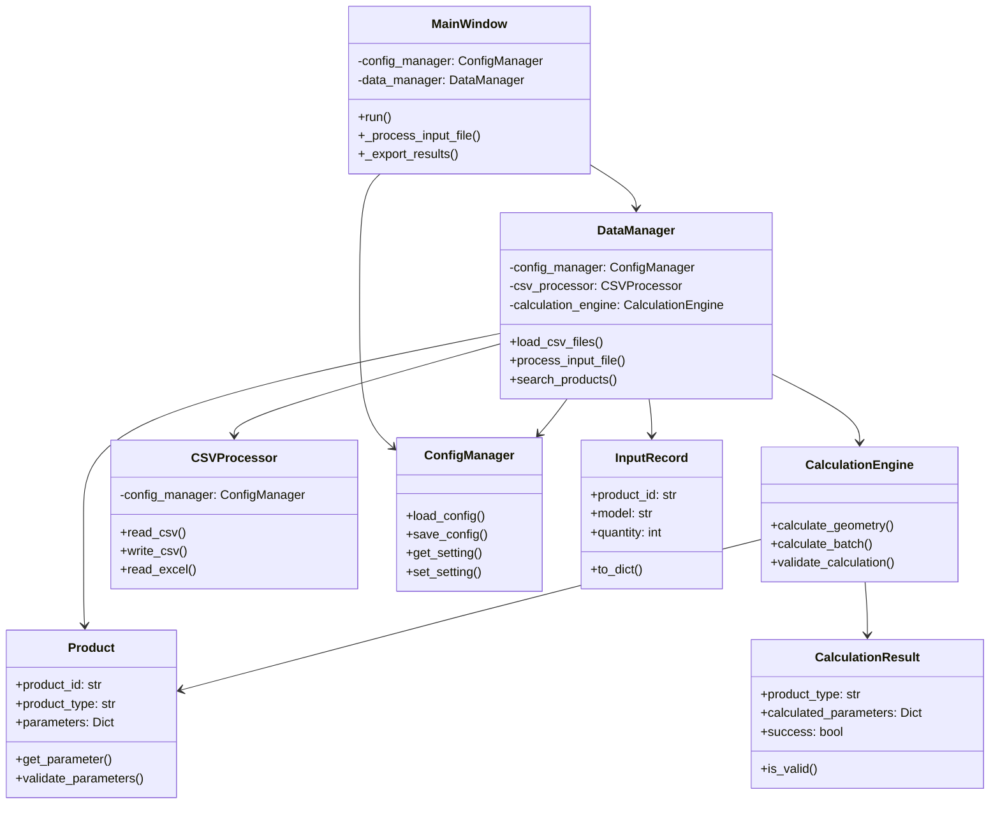

# DNC参数计算系统 - 类图设计文档

## 系统架构概览

```
┌─────────────────────────────────────────────────────────────┐
│                    DNC参数计算系统                          │
├─────────────────────────────────────────────────────────────┤
│  应用层 (UI Layer)        │  业务逻辑层 (Business Layer)    │
│  ──────────────────────   │  ────────────────────────────   │
│  • MainWindow            │  • DataManager                 │
│  • InputDialog           │  • CalculationEngine           │
│  • SettingsDialog        │  • CSVProcessor                │
│                          │  • ConfigManager               │
├─────────────────────────────────────────────────────────────┤
│                   数据层 (Data Layer)                       │
│                   ───────────────────                       │
│                   • Product                               │
│                   • InputRecord                           │
│                   • CalculationResult                     │
│                   • MasterFile                            │
│                   • SystemConfiguration                   │
└─────────────────────────────────────────────────────────────┘
```

## 详细类设计

### 1. 数据模型类 (Data Models)

#### Product 类
```python
@dataclass
class Product:
    product_id: str
    product_type: str
    parameters: Dict[str, Any]
    drawing_path: Optional[str] = None
    quantity: int = 1
    
    def get_parameter(self, key: str, default: Any = None) -> Any
    def update_parameter(self, key: str, value: Any)
    def validate_parameters(self) -> List[str]
```

**职责**:
- 封装产品基本信息
- 管理产品参数
- 验证参数完整性

**关联关系**:
- 被 `DataManager` 管理
- 被 `CalculationEngine` 使用

#### InputRecord 类
```python
@dataclass
class InputRecord:
    product_id: str
    model: str
    quantity: int
    master_data: Dict[str, Any]
    calculated_params: Optional[Dict[str, Any]] = None
    
    def to_dict(self) -> Dict[str, Any]
```

**职责**:
- 封装输入记录数据
- 提供数据转换功能

**关联关系**:
- 包含 `Product` 信息
- 被 `DataManager` 处理

#### CalculationResult 类
```python
@dataclass
class CalculationResult:
    product_type: str
    input_parameters: Dict[str, Any]
    calculated_parameters: Dict[str, Any]
    success: bool
    error_message: Optional[str] = None
    calculation_time: Optional[float] = None
    
    def is_valid(self) -> bool
```

**职责**:
- 封装计算结果
- 提供验证功能

**关联关系**:
- 由 `CalculationEngine` 生成
- 被 `DataManager` 存储

### 2. 业务逻辑类 (Business Logic)

#### DataManager 类
```python
class DataManager:
    def __init__(self, config_manager: ConfigManager)
    def load_csv_files(self) -> bool
    def process_input_file(self, file_path: str) -> Tuple[List[Dict], List[str]]
    def search_products(self, keyword: str) -> List[str]
    def get_product_data(self, product_type: str) -> Optional[Dict[str, Any]]
    def get_all_product_types(self) -> List[str]
    def get_statistics(self) -> Dict[str, Any]
    def save_data(self, data: List[Dict], file_path: str, file_type: str) -> bool
```

**职责**:
- 管理所有数据操作
- 处理CSV文件读写
- 提供数据查询功能
- 管理数据缓存

**关联关系**:
- 使用 `ConfigManager` 获取配置
- 使用 `CSVProcessor` 处理文件
- 管理 `Product` 和 `InputRecord` 对象

#### CalculationEngine 类
```python
class CalculationEngine:
    def __init__(self)
    def calculate_geometry(self, product: Product, input_params: Dict[str, Any] = None) -> Dict[str, Any]
    def calculate_batch(self, products: List[Product], input_params_list: List[Dict[str, Any]] = None) -> List[CalculationResult]
    def validate_calculation(self, product_type: str, calculated_params: Dict[str, Any]) -> Tuple[bool, List[str]]
    def calculate_dimension_tolerance(self, nominal_value: float, tolerance: str) -> Tuple[float, float]
```

**职责**:
- 执行几何计算
- 批量处理计算任务
- 验证计算结果
- 管理计算精度

**关联关系**:
- 处理 `Product` 对象
- 生成 `CalculationResult` 对象

#### CSVProcessor 类
```python
class CSVProcessor:
    def __init__(self, config_manager: ConfigManager)
    def read_csv(self, file_path: str) -> Tuple[List[Dict[str, Any]], List[str]]
    def write_csv(self, data: List[Dict[str, Any]], file_path: str) -> bool
    def read_excel(self, file_path: str) -> Tuple[List[Dict[str, Any]], List[str]]
    def write_excel(self, data: List[Dict[str, Any]], file_path: str) -> bool
    def validate_csv_structure(self, data: List[Dict[str, Any]]) -> List[str]
```

**职责**:
- 处理CSV和Excel文件读写
- 验证文件结构
- 处理编码问题

**关联关系**:
- 被 `DataManager` 使用
- 使用 `ConfigManager` 获取配置

### 3. 配置管理类 (Configuration)

#### ConfigManager 类
```python
class ConfigManager:
    def __init__(self, config_file: str = "config/config.ini")
    def load_config(self) -> bool
    def save_config(self) -> bool
    def get_setting(self, section: str, key: str, default: Any = None) -> Any
    def set_setting(self, section: str, key: str, value: Any) -> bool
    def get_all_settings(self) -> Dict[str, Dict[str, Any]]
    def validate_config(self) -> List[str]
```

**职责**:
- 管理应用程序配置
- 提供配置读写接口
- 验证配置完整性

**关联关系**:
- 被所有其他类使用
- 管理 `SystemConfiguration` 对象

#### SystemConfiguration 类
```python
@dataclass
class SystemConfiguration:
    master_directory: str
    log_directory: str
    input_directory: str
    output_directory: str
    version: str
    language: str
    auto_save: bool
    backup_enabled: bool
    calculation_precision: int
    rounding_method: str
    auto_validation: bool
    
    def to_dict(self) -> Dict[str, Any]
```

**职责**:
- 封装系统配置信息
- 提供配置验证

### 4. 用户界面类 (User Interface)

#### MainWindow 类
```python
class MainWindow:
    def __init__(self, config_manager: ConfigManager, data_manager: DataManager)
    def run(self)
    def _create_widgets(self)
    def _process_input_file(self)
    def _export_results(self)
    def _search_products(self)
    def _update_data_display(self)
```

**职责**:
- 管理主窗口界面
- 处理用户交互
- 协调业务逻辑

**关联关系**:
- 使用 `ConfigManager` 和 `DataManager`
- 调用业务逻辑方法

## 类关系图



## 数据流设计

### 1. 输入处理流程
```
用户输入CSV文件 → MainWindow → DataManager → CSVProcessor
                                     ↓
                                Product对象创建
                                     ↓
                            CalculationEngine计算
                                     ↓
                        CalculationResult生成
                                     ↓
                            MainWindow显示结果
```

### 2. 配置管理流程
```
应用程序启动 → ConfigManager加载配置 → 各组件初始化
用户修改设置 → ConfigManager保存配置 → 系统行为更新
```

### 3. 错误处理流程
```
操作执行 → 异常捕获 → 错误信息记录 → 用户界面显示
                              ↓
                        日志文件记录
```

## 设计模式应用

### 1. 单例模式 (Singleton)
- `ConfigManager` 确保配置一致性
- `DataManager` 管理全局数据状态

### 2. 工厂模式 (Factory)
- `Product` 对象创建
- `CalculationResult` 对象创建

### 3. 观察者模式 (Observer)
- 配置变更通知
- 数据更新通知

### 4. 策略模式 (Strategy)
- 不同计算算法的切换
- 不同文件格式的处理

## 扩展性设计

### 1. 插件架构
- 可扩展的计算算法
- 可支持的文件格式
- 自定义验证规则

### 2. 配置驱动
- 运行时配置调整
- 用户自定义设置
- 环境特定配置

### 3. 模块化设计
- 清晰的职责分离
- 松耦合的组件关系
- 易于测试和维护

这个类图设计确保了系统的可维护性、可扩展性和代码重用性，同时保持了与原始VB.NET项目的功能兼容性。
