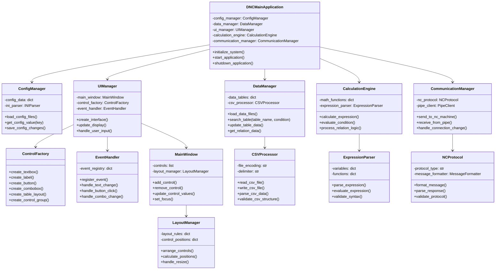

# 系统类图设计文档

## 概述

本文档基于VB.NET源码分析结果，设计Python重构的系统类图，为代码重构提供清晰的架构指导。

## 整体类图设计



## 详细类设计说明

### 1. DNCMainApplication (主应用类)

**职责**：协调整个应用程序的运行，管理各个模块的初始化和协作。

**主要方法**：
- `initialize_system()`: 初始化所有模块
- `start_application()`: 启动应用程序
- `shutdown_application()`: 关闭应用程序
- `handle_system_events()`: 处理系统级事件

**对应VB.NET方法**：
- `Frm_main_Load()`
- `Frm_main_Shown()`
- `Frm_main_Closing()`

### 2. ConfigManager (配置管理类)

**职责**：管理应用程序的配置文件和设置。

**主要方法**：
- `load_config_files()`: 加载所有配置文件
- `get_config_value(key)`: 获取配置值
- `save_config_changes()`: 保存配置变更
- `validate_config()`: 验证配置完整性

**对应VB.NET方法**：
- `setIni()`
- `setPRG()`

### 3. DataManager (数据管理类)

**职责**：管理所有数据文件的加载、搜索和更新。

**主要方法**：
- `load_data_files()`: 加载数据文件
- `search_table(table_name, condition)`: 搜索数据表
- `update_table_data()`: 更新表数据
- `get_relation_data()`: 获取关系数据

**对应VB.NET方法**：
- `LoadFileToDic()`
- `LoadFileToTBL()`
- `searchT_relation()`
- `searchT_calc()`
- `setRelationTBL()`

### 4. UIManager (界面管理类)

**职责**：管理用户界面的创建、更新和交互。

**主要方法**：
- `create_interface()`: 创建用户界面
- `update_display()`: 更新显示
- `handle_user_input()`: 处理用户输入
- `manage_control_states()`: 管理控件状态

**对应VB.NET方法**：
- `setControls()`
- `delControls()`
- `addControls()`
- `setCntrlsEnable()`

### 5. ControlFactory (控件工厂类)

**职责**：创建和管理各种界面控件。

**主要方法**：
- `create_textbox()`: 创建文本框
- `create_label()`: 创建标签
- `create_button()`: 创建按钮
- `create_combobox()`: 创建组合框
- `create_table_layout()`: 创建表格布局
- `create_control_group()`: 创建控件组

**对应VB.NET方法**：
- `makeTextBox()`
- `makeLabel()`
- `makeButtonInput()`
- `makeCMBBox()`
- `makeTLP()`
- `makeCntrlLoad()` 等所有makeCntrl*方法

### 6. EventHandler (事件处理类)

**职责**：处理用户界面的事件和交互。

**主要方法**：
- `register_event()`: 注册事件处理
- `handle_text_change()`: 处理文本变更
- `handle_button_click()`: 处理按钮点击
- `handle_combo_change()`: 处理组合框变更

**对应VB.NET方法**：
- `txt_change()`
- `btn_input_Click()`
- `cmb_change()`
- `Btn_switch_click()`

### 7. CalculationEngine (计算引擎类)

**职责**：执行数学计算和逻辑判断。

**主要方法**：
- `calculate_expression()`: 计算表达式
- `evaluate_condition()`: 评估条件
- `process_relation_logic()`: 处理关系逻辑
- `validate_calculation()`: 验证计算

**对应VB.NET方法**：
- `getCalcResult()`
- `getCalcMathResult()`
- `judgeRelation()`
- `chkMath()`

### 8. CommunicationManager (通信管理类)

**职责**：管理与外部设备的通信。

**主要方法**：
- `send_to_nc_machine()`: 发送到NC机床
- `receive_from_pipe()`: 从管道接收数据
- `handle_connection_change()`: 处理连接变更

**对应VB.NET方法**：
- `makeSendTxt()`
- `makeSendTxt_rex()`
- `makeSendTxt_brother()`
- `ConnectionChange()`
- `ReceiveData()`

### 9. MainWindow (主窗口类)

**职责**：管理主窗口的控件和布局。

**主要方法**：
- `add_control()`: 添加控件
- `remove_control()`: 移除控件
- `update_control_values()`: 更新控件值
- `set_focus()`: 设置焦点

**对应VB.NET方法**：
- `dispTargetPRG()`
- `setValueToRelationCntrl()`
- `setValueToMeasureTB()`

### 10. CSVProcessor (CSV处理器类)

**职责**：处理CSV文件的读写和解析。

**主要方法**：
- `read_csv_file()`: 读取CSV文件
- `write_csv_file()`: 写入CSV文件
- `parse_csv_data()`: 解析CSV数据
- `validate_csv_structure()`: 验证CSV结构

### 11. ExpressionParser (表达式解析器类)

**职责**：解析和计算数学表达式。

**主要方法**：
- `parse_expression()`: 解析表达式
- `evaluate_expression()`: 计算表达式
- `validate_syntax()`: 验证语法

### 12. NCProtocol (NC协议类)

**职责**：处理NC机床通信协议。

**主要方法**：
- `format_message()`: 格式化消息
- `parse_response()`: 解析响应
- `validate_protocol()`: 验证协议

### 13. LayoutManager (布局管理类)

**职责**：管理界面控件的布局。

**主要方法**：
- `arrange_controls()`: 排列控件
- `calculate_positions()`: 计算位置
- `handle_resize()`: 处理大小调整

## 类间关系说明

### 1. 组合关系
- `DNCMainApplication` 包含其他所有管理器类
- `UIManager` 包含 `ControlFactory`、`EventHandler`、`MainWindow`
- `DataManager` 包含 `CSVProcessor`
- `CalculationEngine` 包含 `ExpressionParser`
- `CommunicationManager` 包含 `NCProtocol`

### 2. 依赖关系
- 所有类都依赖于 `ConfigManager` 获取配置
- `EventHandler` 依赖于 `CalculationEngine` 进行计算
- `ControlFactory` 依赖于 `DataManager` 获取数据定义

### 3. 协作关系
- `UIManager` 和 `DataManager` 协作更新界面数据
- `EventHandler` 和 `CalculationEngine` 协作处理用户输入
- `CommunicationManager` 和 `UIManager` 协作更新通信状态

## 数据流设计

### 1. 配置加载流程
```
ConfigManager → DataManager → UIManager → ControlFactory
```

### 2. 用户交互流程
```
EventHandler → CalculationEngine → DataManager → UIManager
```

### 3. 数据计算流程
```
DataManager → CalculationEngine → UIManager
```

### 4. 通信流程
```
EventHandler → CommunicationManager → NCProtocol
```

## 设计原则应用

### 1. 单一职责原则
- 每个类都有明确的单一职责
- 功能模块清晰分离

### 2. 开闭原则
- 通过工厂模式支持控件扩展
- 通过协议类支持通信协议扩展

### 3. 依赖倒置原则
- 高层模块不依赖低层模块
- 通过接口进行抽象

### 4. 接口隔离原则
- 每个接口职责单一
- 避免接口臃肿

## Python实现建议

### 1. 使用现代Python特性
- 类型注解提高代码可读性
- 数据类简化数据结构
- 异步编程处理IO操作

### 2. 选择合适的GUI框架
- PyQt/PySide：功能丰富，跨平台
- Tkinter：Python标准库，简单易用
- CustomTkinter：现代化界面

### 3. 数据管理
- 使用pandas处理表格数据
- 使用SQLAlchemy管理数据库
- 使用configparser处理配置文件

### 4. 计算引擎
- 使用sympy进行符号计算
- 使用numpy进行数值计算
- 自定义表达式解析器

---

*本类图设计为Python重构提供了清晰的架构指导，确保代码的可维护性和可扩展性。*
