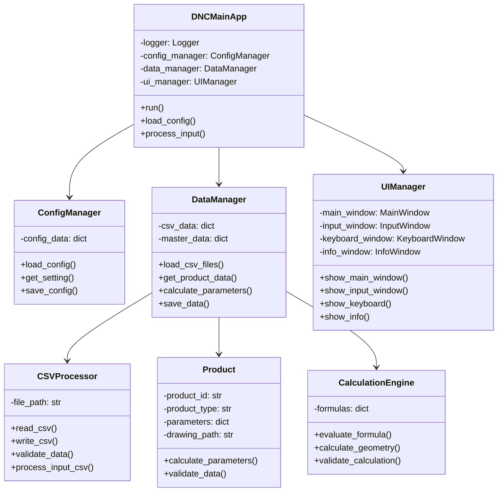

# DNC Python 项目重写方案

## 项目概述

本项目是基于原VB.NET DNC2.05系统的Python重写版本。原系统是一个数控设备管理软件，主要用于产品型号管理、参数计算和程序生成。

## 系统架构

### 核心类图



### 主要功能模块

1. **配置管理** (ConfigManager)
   - 读取和解析INI配置文件
   - 管理应用程序设置
   - 处理路径配置

2. **数据管理** (DataManager)
   - 加载和处理CSV数据文件
   - 产品型号管理
   - 参数计算和验证

3. **用户界面** (UIManager)
   - 主窗口管理
   - 输入窗口处理
   - 虚拟键盘支持
   - 信息显示

4. **CSV处理** (CSVProcessor)
   - CSV文件读写
   - 数据验证
   - 输入文件处理

## 新增功能

### CSV输入功能

新增从input.csv文件批量输入系统产品指示书编号、型号、数量的功能：

- **输入格式**: 产品编号,型号,数量
- **批量处理**: 支持一次导入多条记录
- **数据验证**: 自动验证产品型号的有效性
- **错误处理**: 提供详细的错误信息和日志

## 文件结构

```
DNC_Python_Project/
├── src/
│   ├── __init__.py
│   ├── main.py              # 主应用程序
│   ├── config/
│   │   ├── __init__.py
│   │   └── config_manager.py
│   ├── data/
│   │   ├── __init__.py
│   │   ├── data_manager.py
│   │   ├── csv_processor.py
│   │   └── models.py
│   ├── ui/
│   │   ├── __init__.py
│   │   ├── ui_manager.py
│   │   ├── main_window.py
│   │   ├── input_window.py
│   │   └── keyboard_window.py
│   └── utils/
│       ├── __init__.py
│       ├── logger.py
│       └── calculation.py
├── data/
│   ├── master/              # 原master目录结构
│   └── input.csv           # 新增输入文件
├── config/
│   └── app_config.ini
├── requirements.txt
└── README.md
```

## 技术栈

- **Python 3.8+**
- **PyQt5/PySide6**: GUI框架
- **pandas**: 数据处理
- **logging**: 日志系统
- **configparser**: 配置管理

## 安装和运行

1. 安装依赖:
```bash
pip install -r requirements.txt
```

2. 运行应用:
```bash
python src/main.py
```

## 数据迁移

原系统的CSV文件结构将完全保留，确保向后兼容性。新增的input.csv功能将无缝集成到现有工作流程中。
